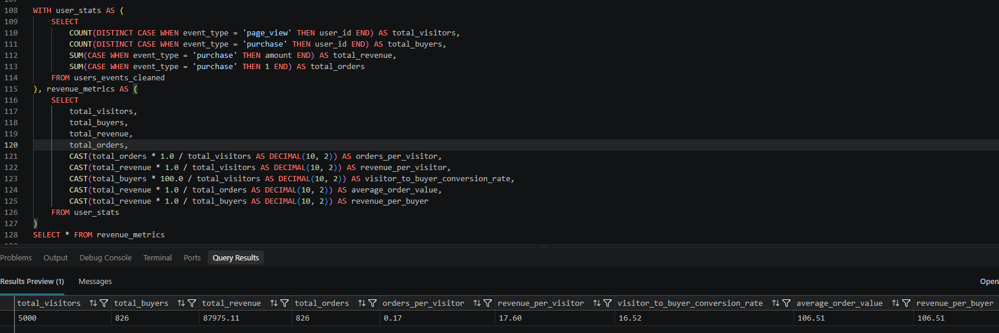
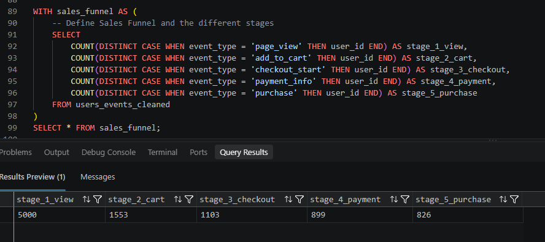
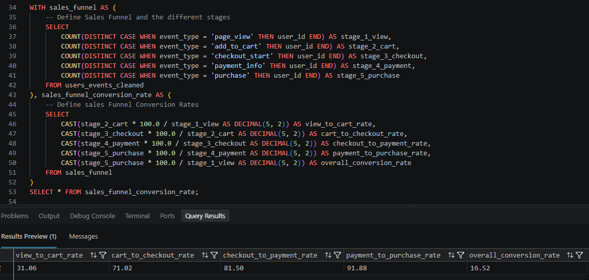
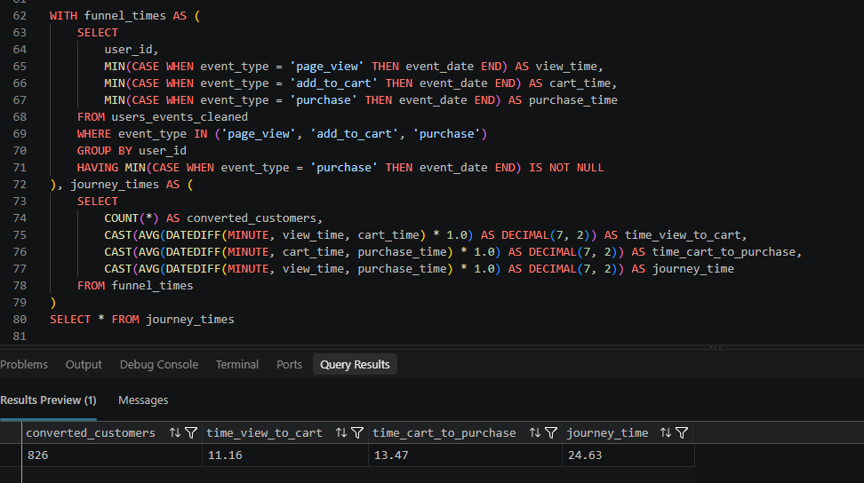
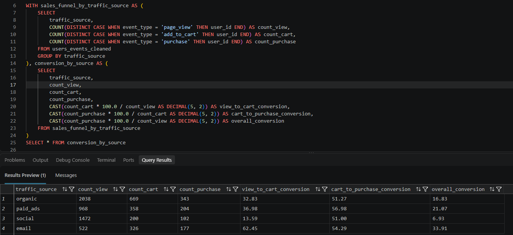

# Ecommerce Sales Funnel Analysis using SQL

> An end to end SQL analysis project that examines ecommerce user behavior across the customer journey, identifies where potential customers drop off, evaluates traffic source conversion performance, measures customer journey time, and translates findings into actionable business recommendations.


---

# Executive Summary


---

This project analyzes the ecommerce purchase journey of **5,000 unique visitors** using SQL.

The business generated:

- **$87,975.11** in total revenue
- **826 buyers**
- **826 orders**
- **16.52% overall conversion rate**
- **$106.51 average order value**
- **$17.60 revenue per visitor**

While the headline metrics indicate solid performance, the detailed funnel analysis reveals a significant weakness in the early stages of the customer journey.

## Primary Finding

The largest customer drop off occurs between:

# Page View → Add to Cart

Out of **5,000 unique visitors**, only **1,553 users** added an item to their cart.

This represents:

### **31.06% View to Cart Conversion**

### **68.94% Drop Off Before Add to Cart**

By contrast users who progress further through the funnel convert at much stronger rates.

Most notably:

**91.88% of users who reach the Payment Info stage complete a purchase.**

The strongest data supported conclusion is therefore:

### The primary bottleneck is at the top of the funnel, not in the final checkout stage.

---

# Business Problem


---

The business appears healthy when viewed through high level KPIs such as:

- Revenue
- Total visitors
- Average order value
- Overall conversion rate
- Revenue per visitor

However, these surface level metrics do not answer the most important business question:

### Where exactly are potential customers being lost before they convert?

A strong overall conversion rate does not reveal:

- Where users abandon the customer journey
- Whether checkout is causing friction
- Whether users are failing to develop purchase intent
- Which traffic sources generate the strongest conversion
- Which stage should be prioritized for optimization

This project therefore performs a **sales funnel diagnostic** to identify where the greatest opportunity for conversion improvement exists.

---

# Business Questions


---

The analysis was designed to answer the following business questions:

### Funnel Performance

- How many unique users reach each stage of the sales funnel?
- Where does the largest customer drop off occur?
- What percentage of users progress between consecutive stages?
- What is the overall conversion rate from Page View to Purchase?

### Revenue Performance

- How much total revenue has the business generated?
- How many buyers and orders were recorded?
- What is the Average Order Value?
- What is the Revenue Per Visitor?
- What is the Revenue Per Buyer?

### Customer Journey

- How long does the average customer take to add an item to their cart?
- How long does it take for converted customers to complete a purchase?
- How long is the total recorded customer journey?

### Traffic Source Performance

- Which traffic sources generate the most visitors?
- Which traffic sources generate the highest conversion rates?
- Which channels perform strongly at the View → Cart stage?
- Which channels underperform?

---

# Data Used


---

The analysis uses three categories of ecommerce information.

## 1. User Event Data

The customer journey is reconstructed using recorded events:

```text
Page View
    ↓
Add to Cart
    ↓
Checkout Start
    ↓
Payment Info
    ↓
Purchase
```

These events allow the analysis to measure user progression through the sales funnel.

---

## 2. Order Transaction Data

Order information is used to calculate:

- Total revenue
- Number of orders
- Average Order Value
- Revenue per buyer

---

## 3. Traffic Source Information

Users are grouped by acquisition channel:

- Organic
- Paid Ads
- Social
- Email

This allows conversion performance to be compared across different traffic sources.

---

# Analysis Methodology


---

The analysis follows the customer journey from the earliest recorded interaction to the final purchase.

```text
1. Page View
        ↓
2. Add to Cart
        ↓
3. Checkout Start
        ↓
4. Payment Info
        ↓
5. Purchase
```

The SQL analysis uses:

- Common Table Expressions (CTEs)
- Conditional aggregation
- Distinct user counting
- Conversion rate calculations
- Timestamp analysis
- Traffic source segmentation

The analysis is organized into the following major components:

```text
DATA
  ↓
USER EVENT ANALYSIS
  ↓
FUNNEL CONSTRUCTION
  ↓
CONVERSION ANALYSIS
  ↓
REVENUE ANALYSIS
  ↓
JOURNEY TIME ANALYSIS
  ↓
TRAFFIC SOURCE ANALYSIS
  ↓
BUSINESS INSIGHTS
```

---

# Core Business Metrics

The first objective was to establish the overall performance baseline of the business.

The analysis calculates:

- Total unique visitors
- Total buyers
- Total revenue
- Total orders
- Orders per visitor
- Revenue per visitor
- Visitor to buyer conversion rate
- Average Order Value
- Revenue per buyer

---

## SQL Query



---

## Key Metrics

| Metric | Value |
|---|---:|
| Total Unique Visitors | **5,000** |
| Total Buyers | **826** |
| Total Revenue | **$87,975.11** |
| Total Orders | **826** |
| Orders Per Visitor | **0.17** |
| Revenue Per Visitor | **$17.60** |
| Visitor to Buyer Conversion Rate | **16.52%** |
| Average Order Value | **$106.51** |
| Revenue Per Buyer | **$106.51** |

---

## Business Interpretation

The business has established a solid baseline with:

- Nearly **$88K in revenue**
- **5,000 unique visitors**
- **826 completed purchases**
- A **16.52% overall visitor to buyer conversion rate**

However, these metrics alone do not reveal where the business is losing potential customers.

The next analysis therefore examines the complete customer journey.

---

# Sales Funnel Analysis


---

The sales funnel was constructed to measure the number of unique users reaching each stage.

## Funnel Stages

```text
Page View
    ↓
Add to Cart
    ↓
Checkout Start
    ↓
Payment Info
    ↓
Purchase
```

---

## SQL Query



---

## Funnel Results

| Funnel Stage | Users | % of Total Visitors |
|---|---:|---:|
| Page View | **5,000** | 100.00% |
| Add to Cart | **1,553** | 31.06% |
| Checkout Start | **1,103** | 22.06% |
| Payment Info | **899** | 17.98% |
| Purchase | **826** | 16.52% |

---

## Largest Funnel Leak

The largest customer drop off occurs immediately after the Page View stage:

```text
5,000 Users
    ↓
1,553 Users
```

Only **31.06%** of users add an item to their cart.

This means:

### **68.94% of users drop before Add to Cart.**

This is the single largest loss of potential customers anywhere in the recorded funnel.

---

# Funnel Conversion Analysis

The next step calculates how efficiently users progress from one stage to the next.

The conversion rates are calculated as:

```text
Add to Cart / Page View

Checkout Start / Add to Cart

Payment Info / Checkout Start

Purchase / Payment Info

Purchase / Page View
```

---

## SQL Query



---

## Conversion Results

| Funnel Transition | Conversion Rate |
|---|---:|
| View → Add to Cart | **31.06%** |
| Add to Cart → Checkout | **71.02%** |
| Checkout → Payment Info | **81.50%** |
| Payment Info → Purchase | **91.88%** |
| Overall View → Purchase | **16.52%** |

---

## Key Insight

Conversion efficiency improves as users progress deeper into the funnel.

The weakest transition is clearly:

### View → Add to Cart

The strongest transition is:

### Payment Info → Purchase

### **91.88% conversion**

---

# This Is Not Primarily a Checkout Problem


---

The strongest evidence comes from the final funnel stage.

## Checkout Completion

### **91.88%**

### of users who reach the Payment stage complete their purchase.

This means the final conversion stages are performing significantly better than the beginning of the customer journey.

### Therefore:

The primary business problem identified by this dataset is not the late stage checkout process.

### The main opportunity is:

# Converting more visitors into users with purchase intent.

Specifically:

```text
Page View
    ↓
Add to Cart
```

---

# Customer Journey Time Analysis

The project analyzes how long converted customers take to move through the recorded journey.

For each converted user, the analysis identifies:

```text
First Page View
        ↓
First Add to Cart
        ↓
First Purchase
```

---

## SQL Query



---

## Journey Time Results

| Journey Metric | Average Time |
|---|---:|
| View → Add to Cart | **11.16 minutes** |
| Add to Cart → Purchase | **13.47 minutes** |
| Total Journey Time | **24.63 minutes** |

---

## Business Interpretation

Converted customers take approximately:

### **24.63 minutes**

on average to move from their first recorded Page View to Purchase.

The early part of the journey takes approximately **11.16 minutes before Add to Cart**.

This indicates that users spend a meaningful amount of time evaluating products before demonstrating purchase intent.

Potential areas for further investigation include:

- Product discovery
- Product information
- Customer reviews
- Product imagery
- Pricing visibility
- Shipping information
- Mobile experience
- Trust signals

### The data identifies where users drop off and how long the recorded journey takes. It does not directly establish the specific reason why users abandon the funnel.

---

# Traffic Source Analysis

The project compares user behavior across:

- Organic
- Paid Ads
- Social
- Email

The analysis measures:

- Unique visitors
- Users who add products to cart
- Users who purchase
- View to Cart conversion
- Cart to Purchase conversion
- Overall conversion

---

## SQL Query



---

## Conversion Results by Traffic Source

| Traffic Source | Visitors | Added to Cart | Purchases | View → Cart | Cart → Purchase | Overall Conversion |
|---|---:|---:|---:|---:|---:|---:|
| Organic | 2,038 | 669 | 343 | **32.83%** | **51.27%** | **16.83%** |
| Paid Ads | 968 | 358 | 204 | **36.98%** | **56.98%** | **21.07%** |
| Social | 1,472 | 200 | 102 | **13.59%** | **51.00%** | **6.93%** |
| Email | 522 | 326 | 177 | **62.45%** | **54.29%** | **33.91%** |

---

## Email — Highest Conversion Rate

Email has the highest observed overall conversion rate:

### **33.91%**

It also has the highest View → Add to Cart conversion rate:

### **62.45%**

This indicates that users acquired through Email are substantially more likely to progress into the purchase funnel.

### Recommendation

Investigate:

- High performing customer segments
- Campaign performance
- Personalization
- Targeting strategy

---

## Paid Ads — Strong Conversion Performance

Paid Ads generate:

### **21.07% overall conversion**

and:

### **36.98% View to Cart conversion**

This makes Paid Ads the second best traffic source by overall conversion rate.

### Recommendation

Further analysis should evaluate:

- Acquisition cost
- Return on Ad Spend
- Campaign performance
- Audience targeting

---

## Organic — Largest Traffic Source

Organic generates:

- **2,038 visitors**
- **343 purchases**

This makes Organic the largest contributor to traffic and the largest contributor to total purchases.

Its overall conversion rate is:

### **16.83%**

### Recommendation

Focus on:

- High intent SEO
- Landing page optimization
- Product discovery
- Conversion oriented content

---

## Social — Lowest Conversion Performance

Social generates:

- **1,472 visitors**
- **200 Add to Cart users**
- **102 purchases**

Its overall conversion rate is:

### **6.93%**

The View → Add to Cart conversion rate is also the lowest:

### **13.59%**

### Recommendation

Investigate whether Social traffic should be treated primarily as:

- Awareness traffic
- Discovery traffic
- Retargeting audiences

The business should avoid assuming that Social itself is inherently low quality without further campaign level analysis.

---

# Key Business Findings

## The Largest Opportunity Is at the Top of the Funnel

The biggest customer loss occurs before Add to Cart:

### **68.94% drop off**

The business should prioritize improving the earliest major conversion bottleneck.

---

## Late Stage Conversion Is Strong

Once users reach the Payment Info stage:

### **91.88% complete a purchase**

The available data does not identify the final checkout stage as the primary source of lost revenue.

---

## Email Has the Highest Observed Conversion Rate

Email converts:

### **33.91% of visitors**

This is the highest overall conversion rate among the analyzed traffic sources.

---

## Social Has the Lowest Observed Conversion Rate

Social converts:

### **6.93% of visitors**

The most significant weakness occurs at the transition from:

### **View → Add to Cart**

---

## Customers Take Approximately 25 Minutes to Complete the Recorded Journey

The average total journey time is:

### **24.63 minutes**

This suggests a customer journey involving product evaluation before purchase.

---

# Strategic Recommendations


---

# Improve Product Discovery

Improve how users find relevant products.

Potential areas for experimentation:

- Homepage navigation
- Category pages
- Search functionality
- Product recommendations
- Product filtering

### Goal

Increase:

### View → Add to Cart Conversion

---

# Strengthen Product Engagement

Users drop before demonstrating strong purchase intent.

Potential areas for experimentation:

- Customer reviews
- Product ratings
- Product imagery
- Product descriptions
- Pricing communication
- Shipping information
- Trust signals

These should be treated as hypotheses and tested through controlled experimentation.

---

# Re engage Early Funnel Drop Offs

The largest recoverable audience consists of users who:

### View products but leave without adding an item to the cart.

Potential strategies include:

- Retargeting campaigns
- Recently viewed product campaigns
- Personalized recommendations
- Email remarketing
- Promotional testing

---

# Use the Largest Bottleneck as the Primary Optimization Metric

The most important experiment metric should be:

### View → Add to Cart Conversion Rate

The objective should be to determine which specific changes increase the percentage of visitors entering the high converting lower funnel.

---

# Expected Business Impact


---

The presentation identifies a potential:

### **15–22% Revenue Increase Opportunity**

by improving conversion at the:

### View → Add to Cart stage

## Important Note

The **15–22% figure is presented as a scenario based opportunity estimate**, not as a guaranteed forecast.

The strongest data supported conclusion is:

```text
More Existing Visitors
        ↓
More Add to Cart Users
        ↓
More Users Enter High Converting Funnel Stages
        ↓
More Potential Purchases
        ↓
Higher Potential Revenue
```

Because downstream conversion rates are already strong, improving the earliest major bottleneck may produce a significant downstream effect.

---

# SQL Concepts Demonstrated

This project demonstrates practical use of:

- Common Table Expressions (CTEs)
- Multiple CTEs
- Conditional Aggregation
- `COUNT(DISTINCT ...)`
- `CASE WHEN`
- `SUM()`
- `AVG()`
- `MIN()`
- `GROUP BY`
- `HAVING`
- `CAST()`
- `DATEDIFF()`
- Funnel Analysis
- Conversion Rate Calculation
- Customer Journey Analysis
- Revenue KPI Analysis
- Traffic Source Segmentation

---

# Final Conclusion

This project demonstrates why high level business metrics alone are not enough to diagnose conversion performance.

The ecommerce business has:

- **$87,975.11 in total revenue**
- **5,000 unique visitors**
- **826 buyers**
- **16.52% overall conversion**
- **$106.51 Average Order Value**

However, funnel analysis reveals that the greatest opportunity occurs much earlier in the customer journey.

### **68.94% of users drop before Add to Cart.**

At the same time:

### **91.88% of users reaching Payment complete a purchase.**

The analysis therefore identifies the top of the funnel as the primary area for optimization.

# Final Business Recommendation

### Prioritize improving:

## PAGE VIEW → ADD TO CART

The next step should be controlled experimentation focused on:

- Product discovery
- Product engagement
- Product information
- Trust signals
- User experience

The goal is to determine which changes can move more existing visitors into the high converting lower stages of the funnel.

---

**Project:** Ecommerce Sales Funnel Analysis  
**Tools Used:** SQL Server, SQL  
**Analysis Areas:** Sales Funnel | Conversion | Revenue | Customer Journey | Traffic Sources
